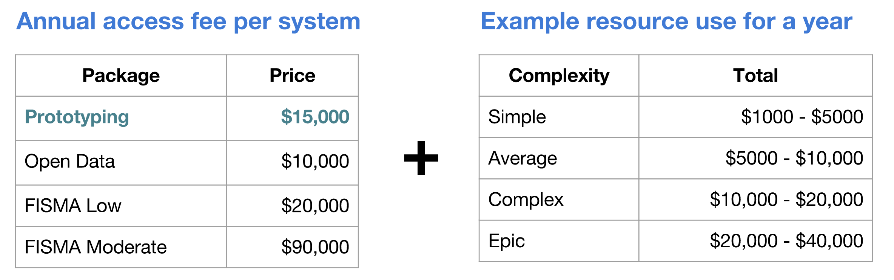

theme: work,7
footer:  
[.hide-footer: true]


^ Thank you for coming!

---

[.hide-footer: true]
[.build-lists: true]


# [fit] I Want You
# [fit] to use **cloud.gov**

* ➡️: Focus on mission
* 🕑: Eliminate long lead times
* 💵: Your tax 💰 ($85B, 8.2% :cloud:)[^1]
* 🇺🇸: Provide great public service

[^1]: CIO IT Dashboard for FY2017 https://www.itdashboard.gov/#learn-basic-stats

^ Thesis. 4 reasons - mY passion and I"d like them to be yours.

^ 1st Enables mission like nothing else available to the federal govt at a TCO below most other options

^ 2nd Lead times. Since 2010 student/advocate for DevOps - AHA! -> Kaching! Dev to Ops, and Ops to Dev. Better everything. Sane. Humane

^ 3rd $$. 8.2% "Provisioned" Services. We can get better value

^ 4th Lastly, a sense of patriotism - and an example to the world 

^ Misson focus / Speed of Exec / $$ Stewardship / We deserve.  How then does ;cg do this?

---


# [fit] 1 / The Mission

---

[.build-lists: true]


# Suppose:

* **A mission**
  * Housing for disaster victims
* **A team**
  * Project / Product Managers
  Designers / Devs 
  Ops / Sec
* **__A platform__**
  * **Build**
  * **Test**
  * **Run**

^ Note: This team has a lot of work to do to realize their mission. 

---

[.build-lists: true]
# Platform

* **Stack:** WebServer, AppServer, Database, Cache, Index
* **Environments:** (Local), Dev, Test, Stage, Prod
* **User** management: Admin, Devs, Auditors
* **Operations:** Patch, Logs, CDN, Scaling, Availability
* **All of this is __commodity__**: think iPad or Android Tablet
* **Acquire: *weeks* // Running: *hours* 
// Build: *months* // Authorize: _weeks_**

^ Stack / Environment / Users / Operations

^ Note: By commodity:  no harder to run your platform run your iPad or Android table. u

^ No genius bar to update it, get new software, or configure the WiFi. 

^These are self-service, have **sane defaults**, include **vetted applications** in a marketplace, and are regularly, or **continually patched.**

^We have the bold nothion that we treat so much of an underlying platform as self-service commodity that is still performant and compliant 


---

# [fit]

* **Open-source Cloud Foundry PaaS atop AWS GovCloud[^2]**
* **Available to Departments & Agencies by _IAA_**
* **FedRAMP P-ATO Moderate, DISA Level 2**
* **Built/run by 18F/TTS/GSA as a cost-recoverable service**

[^2]: Multi-cloud w/ Azure USGov on our roadmap


---

[.footer: ]


**Pre-built environment ready for deploying an application.**

**Developers can focus on mission needs.**

**Common technology resources are managed by an expert operations team:**

* Operating system
* Databases
* Audit trails
* Authorization and authentication
* Load balancing
* Scaling
* Vulnerability scans
* Programming languages
* Automated updates

^ I came to federal service from Chef Software. Enterprise financial, insurance, manufacturing.

^ All the dev: please give me an App Server and a Database and let us get to work!

^ Assuming you get ;cg what does working with us look like?

---


# [fit] 2 / Getting to Launch


---

# Three Stages

* Procure
* Implement
* Authorize

---

# Procure

* Pre-procurement sandbox accounts
* IAAs: weeks instead of months
* Pricing: $$Risk \times Complexity$$
  * Prototyping $$\times$$ Trivial = $20k/ann.
  * FISMA Moderate $$\times$$ Complex = $110k/ann.

---

# Pricing



---

# Implement

* Users, Spaces & Roles
* Apps
* Services

---


# Implement: Users & Roles

* Authentication: 
  * Agency IdP or cloud.gov
* Authorization (CF's UAA)
  * _Manager_, _Developer_ , _Auditor_ $$\times$$
  * _Organization_ (EPA, FEC) & _Space_ (`dev`, `stage`)

---


---


---

# Implement: Dev/Stage/Prod

```sh
cf create-space dev
cf create-space stage
cf create-space prod
```

---

# Implement: Users w/ Spaces

```sh
cf set-space-role peterb dev SpaceDeveloper
cf set-space-role peterb prod SpaceAuditor
```


---

[.build-lists: true]
# [fit] Time machine
* **Procured :white_check_mark:**
* **Implemented:**
  * **Users and Authentication :white_check_mark:**
  * **Dev/Test/Prod Environments :white_check_mark:**
  * **Roles :white_check_mark:**

^ Note: We've done the procurement, you've been provided a ;cloud.gov  organization, and you've integrated your ;cloud.gov authentication with your Agency IDP (which takes a couple of days). Then you've created the space you need and assigned your users to their appropriate roles.   All this take _months_ for bare metal or even of IaaS. And once the procurement is done, this has taken days (or less)  (https://www.google.com/patents/US20060073976)


---

# [fit] Implement: Python Application

``` 
git clone https://github.com/18F/cf-hello-worlds.git
cd cf-hello-worlds/python-flask
cf push cg-flask-demo
open https://cg-flask-demo.app.cloud.gov
cf scale cg-flask-demo -i 4 
```

---

# Implement: Language

|  |  |  |
|---|---|---|
| staticfile | java | ruby 
| nodejs | go | python |
| php | binary | dotnet  |

---

# Implement: Services

|   |  | 
| --- | --- | 
| **Relational databases (RDS)** | PostgreSQL, MySQL, Oracle |
| **Storage (S3)** | Private or public data buckets |
| **Custom domain** | HTTPS + Content Delivery Network |
| **Redis** | In-memory data structure store |
| **Elasticsearch** | Full-text search engine |
| **Service accounts** | For continuous deployment and auditing |
| **Identity provider** |Use cloud.gov authentication in apps |

^ S3: basic vs public, RDS: enc-at-rest, limit ingress.

---

[.autoscale: false]
## Implement: Logs & Diagnostics

* logs: Kibana, custom logdrains
* **`cf ssh`**: diagnose ephemeral containers


---

# Three Stages

* **Procure**
* **Implement**
* Authorize

---

# Authorize

* **Authority to Operate (ATO)**
* **Risk Management Framework (Low, Moderate, High)**
* **NIST 800-53**

^ Note: Fed systems must have ATO from agency CIO, generally follows CISO lead, and they are obliged to follow NIST-800-53 standards, or accept risk of not doing so.

<!-- Risk averse: reputation, bad press, IG report, congress or potentially fired. -->

^ Clarify 325 for MODERATE, simplified, 

^ Systems need to be classified: Violaion of CIA: Low, Moderate, Hi. Depending on classification, then appropriate controls in place. 4004 pages

---

# Authorize: Controls

* DataCenter: All 325 - You're responsible for:
  * Security Guards, PE-3(3)
  * Disk wiping, MP-6(8)
* IaaS: FedRAMP - You _inherit_ ~88 controls, still 237:
  * System logs, AU-12
  * Kernel patches, SI-2
* cloud.gov:
  * See next slide....

^ MP - media protection, PE - physical env, SI - system integrity, AU - audit and accountability

---

[.hide-footer: true]


^ If you want a second example: AU-6 is "Audit review, analysis, and reporting" - cloud.gov provides a built-in logging feature, but customers need to review and analyze their own logs

^ SC - security controls, IA - id and auth, 

---

# Authorize: ATO & Security

* 15 unshared controls, 41 shared
* Simplicity and secure defaults
* Reduce shadow IT (thanks, self-service!)
* Example: **Stack Clash** kernel patch: < 24 hrs

^ credit-card cloud (server in closet).

---

# Three Stages

* **Procure**
* **Implement**
* **Authorize**


^Why wouldn't you use ;cloud.gov ?

---

# [fit] Road map features

* TIC ingress control
* PIV/CAC enabled authentication
* App environment security scanning 
* Attach a persistent file volume to apps
* AWS resource brokering
* Built-in CI/CD service

---


# Let's revisit the mission...

---


# ~~Suppose~~ Realized

* **A mission**
  * Housing for disaster victims
* **A team**
  * Project / Product Managers
  Designers / Devs 
  Ops / Sec
* __**A platform**__
  * **Build**
  * **Test**
  * **Run**

---

[.hide-footer: true]


---

<!-- 


# [fit] 3 / Getting to 👍🏾

---


# Turning :thumbsdown: to :thumbsup:

# Concerns

* Sunk costs
* Requirement uncertainty
* Compliance uncertainty

# Obstacles

* "We have a PaaS"
* 🍎 & 🍊 comparisions

^You may have these reservations, or you may be dealing with folks who do. Many of these reservations, hesitancies, doubts come from some combination of misunderstanding, inaccurate prior knowledge, cognitive fallacies and so. Let's look at how to address some of them

---

* **Concerns**
  * Sunk costs
  * Requirement uncertainty
  * Compliance uncertainty

* **Answers**
  * Start small
  * Start new
  * Learn

---

# Obstacles

* "We have a PaaS"
* 🍎 & 🍊 comparisons

---

# We have a PaaS

## Is it :cloud:?

infinite scale * easy to automate * zero provision time * no up-front fees * testing new tools cheap & encouraged * reduce specialization[^4]

[^4]: Diego Lapiduz, https://www.slideshare.net/dlapiduz/cloud-native-devops-with-cloudgov-workshop


---

# 🍎 & 🍊 comparisons 

Esp when going from DC => :cloud:  For example:

|    | Test | Stage | Prod |
| --- | --- | ------ | ---- | 
| **Varnish** | ~ | 2x2cpu, 16 Gb | 2x2cpu, 16 Gb |
| **Web** | 1x4cpu, 4Gb | 2x4cpu, 4 Gb | 2x4cpu, 4 Gb |
| **App** | 1x8cpu, 64Gb | 2x8cpu, 64 Gb | 2x8cpu, 64Gb |
| **DB** | 1x4cpu, 14Gb | 1x4cpu, 14Gb | 2x8cpu, 14Gb |


^ This is just a rack. Provision once, run forever. Leverage none of the benefits from cloud.  What about cloud services? What A/Zs? What about coding for re-implementation? Nothing in term of CI/CD, continuous release. Utterly under-utilized. etc.
^ Also - Super $$$$

---

# 🍎 & 🍊 comparisions

The power of :cloud: is not in creating a resource, but in destroying it.

---

# Answer: Focus on Mission / Get help explaining technical benefits

* "We have a PaaS"
* 🍎 & 🍊 comparisions

^And some measure of re-education

---

---

# How cloud.gov supports industry

| Good for modern contracting teams and small business | Supports modular contracting and procurement reform | Help vendors produce COTS products that run on a standard platform |
|---|---|---|
| Vendors are excited because cloud.gov offers easy access to modern infrastructure. Enables small teams to deliver great work. | Agencies can set up smaller contracts because the vendor team does not need to maintain infrastructure. | Because cloud.gov uses the open source Cloud Foundry platform, more industry products can easily be run on cloud.gov by agencies. |

---
-->

