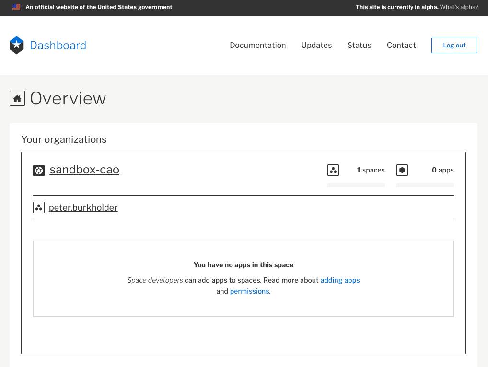

<!-- 
This deck is a separate file since it's mostly screenshots, and shouldn't be printed with the rest of the notes (at least, not at the same size)

NB: These slide are inspired/influenced by https://basics-workshop.cfapps.io & https://github.com/cloudfoundry/summit-training-classes

Notes from dry-run:

- Everyone is focussed at the start of a lab. Deliver content then. Don't try to explain concept while students are trying to get things to work
- Then do lab. Pause for each command to complete. Those who don't need your guidance will pull ahead. Those who do need your guidance will want to go at a real-time pace
- Eliminate all editing
- Eliminate all `cd`. All commands should work even if steps are done out of order
- Be explicit about workspace setup.
  - What directory you're using: $HOME/cg-workshop 
  - Download `cg-workshop.zip` and unpack to ~/cg-workshop
  - Screen: 
    - One window terminal/powershell
    - One window live presentation
    - One window workshop.mda

- Explain goals of workshop:
  - Not training
  - Enough CG that you can use your sandbox workspace effectively
  - Enough CG that you can understand how the pieces fit together
  - Enough CG that you have confidence in it meeting your needs

- Add: Clean up after yourself!

- Add Gifs of the passcode login process w/ ScreenCastr

# Presenter: 

- Keycastr?
- Screenflow?
- Add break slides w/ "will be back...."
- Add :camera: to slide that need a linger by operator

Other notes
---

Also: Fix linebreak before all commands, use different font color for commands

Everyone should go to https://dashboard.fr.cloud.gov before commandline install

Todo: Insert slides/gif showing passcode login....

  DW copies the api url into the browser, so need to clarify there. Perhaps show a GIF of the process.

After cf login, run `cf orgs`

-->

# Why a workshop?

- Demonstrate the cloud.gov
  - Workflow
  - Architecture
- Not a training course, an appetizer
  - Enough that you could use a _sandbox_
- Enough cloud.gov that you can ask:
  - More questions!

---

# As federal PM/Developer/CISO,
# I want some hints on logistics 
# So that I can participate in the workshop

^ We're not printing these slides since mostly screenshots
^ User Stories FTW!

---

Have visible:
- The `powershell` (Windows), 
   `iterm`(Mac) or `terminal` (Mac) window
- The webpage with YouTube Live
- The webpage with [lab notes](https://github.com/18F/cg-workshop/blob/master/02-slides-lab.md)

See next page for example

---

---

If you're using an Amazon Workspace
- Use your local browser for YouTube, Notes
- Don't use the webclient, unless you must
- Set up `powershell` as in the following video

---

Video of setting up Amazon Workspace

---

Image TKTK

---

---

# I want a _cloud.gov account_
# So that I can use _cloud.gov_

---

# 1. Sign up for an account

Let's assume you don't have an account,
and aren't with GSA, EPA or FDIC.

I'll walk through these steps. 

If you already have an account, please make sure you can reach:

* [https://dashboard.fr.cloud.gov](https://dashboard.fr.cloud.gov)

---

# 1: Sign up for an account ...

Visit: [https://account.fr.cloud.gov/signup](https://account.fr.cloud.gov/signup)

---

^ Get access

---

^Invitation sent

---

^View email

---

^Redeem invitation

---

---

---

^ Login again....

---

^ Token Code:

---

# Set up 2-factor authentication

 
You'll need a one-time password 
generator on your smartphone

PIV/CAC is coming (check next) quarter, but for now

Google Authenticator or Microsoft Authenticator or Authy

---

---

---

---

---

---

---

---

---

---

<!-- 

---
-->

# Future logins to, e.g. _https://dashboard.fr.cloud.gov_

  

---

  

---

---

# Further exploration

While we pause until most folks are on [https://dashboard.fr.cloud.gov](https://dashboard.fr.cloud.gov):

* try exploring the other features of the dashboard
* review the docs at [https://cloud.gov/docs](https://cloud.gov/docs/)
* look ahead to 18F's [Before You Ship](https://before-you-ship.18f.gov/) guide
  at [https://before-you-ship.18f.gov](https://before-you-ship.18f.gov/)

^ Wait here until 75% of participants are set up.