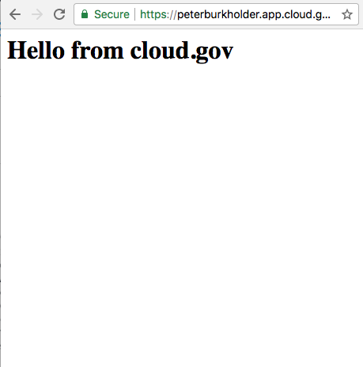
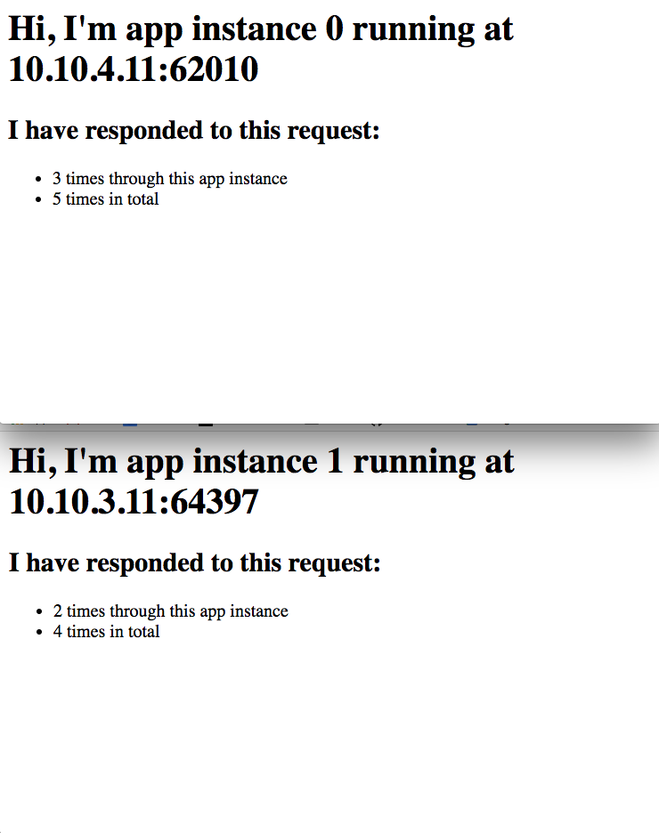
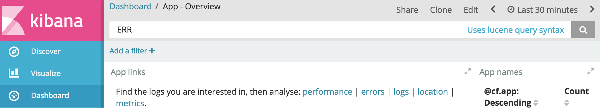
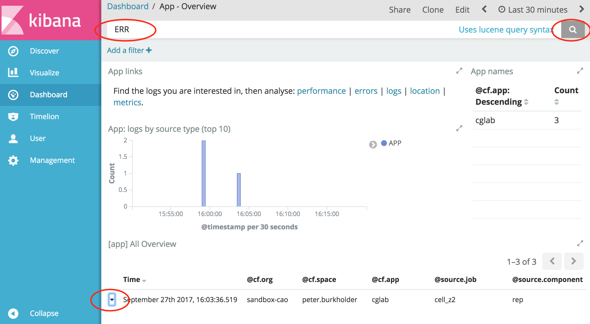
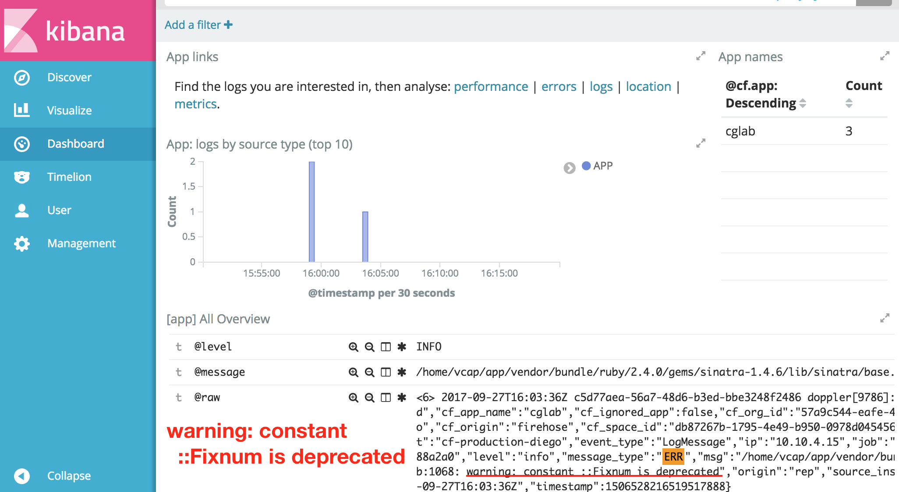

slidenumbers: true
theme: work,7


# I want to have a _command line utility_ installed
# So that I can _deploy apps into cloud.gov_

^ We have our login, now how do we run stuff? With a CLI

---

[.footer: Video Timestamp: 00:14]

# Why the `cf` CLI?

The Cloud Foundry (_CF_) command-line interface (CLI) is a multiplatform binary written in `Go` to interact with the _CF API_.  The CLI provides:

* Automation
* Collaboration
* Corroboration

^ You can put commands into files, with variables, and then run them.<br> You can share code by viewing text files, or even copy/paste, in ways you can't with GUIs (nb: skip Snover anecdote). <br> And with version control you can corroborate that the change you mean to make is the change expressed by the code. <br> With the dashboard we provide overview tools and roles/permissions since those may be needed by project managers how are not using the CLI day-by-day

---

[.footer: Video timestamp 01:45]

# Lab 2: Install cloudfoundry tools and login to cloud.gov

---

[.footer: Video timestamp 01:55]

# 2.1 Select and install the appropriate installer for your computer: 

Go to [https://github.com/cloudfoundry/cli/releases](https://github.com/cloudfoundry/cli/releases) and select an `Installer` for your system. Download and go through the installation steps.

On Macs, with Homebrew, you can use: 

```sh
     brew cask install cloudfoundry-cli
```

On Workspaces, `cf` CLI is already installed.

^ I have not shown the Installer steps as they're different for different systems, and should be familiar to you at this point.

---

[.footer: Video timestamp 02:42]

# 2.1 continued...

After the installer has finished, run the command:

```sh
> cf
``` 

and you should see a list of command options.

^ When you have CF installed and working as on the next slide, we'll continue with authenticating your CLI to your _cloud.gov_ account.

---

[.footer: Video timestamp 02:51]

# Check your work 2.1

You should see output similar the to the following:

```sh
PS /Users/peterburkholder> cf
cf version 6.26.0+9c9a261fd.2017-04-06, Cloud Foundry command line tool
Usage: cf [global options] command [arguments...] [command options]

Before getting started:
  config    login,l      target,t
  help,h    logout,lo

... [snip] ...
```

^ Instructor: wait here until most partipants have CF installed.

---

[.footer: Video timestamp 03:25]

# 2.2 Login to cloud.gov with the _cf_ CLI

You'll enter the command below, and you'll be directed to an _authentication URL_. 

```powershell
cf login --sso -a https://api.fr.cloud.gov
```

Confirm you're logged in by seeing the _orgs_ you belong to:

```powershell
cf orgs
```

---

[.footer: Video timestamp 04:27]

# Check your work 2.2

```
> cf login --sso -a https://api.fr.cloud.gov
API endpoint: https://api.fr.cloud.gov

One Time Code ( Get one at https://login.fr.cloud.gov/passcode )>
```

Visit the URL [https://login.fr.cloud.gov/passcode](https://login.fr.cloud.gov/passcode), complete the login to _cloud.gov_, and you'll get a one-time passcode. Copy/paste the passcode back into the CLI, as show [in this 30s video](https://s3-us-gov-west-1.amazonaws.com/cg-public/cg-otp-login-fast.mp4)

---

[.footer: Video timestamp ]

# _cloud.gov CLI login_


^ View login video at https://s3-us-gov-west-1.amazonaws.com/cg-public/cg-otp-login-fast.mp4

---

[.footer: Video timestamp 06:00]

# Check your work 2.2, continued

```powershell
> cf orgs
Getting orgs as peter.burkholder@cao.gov...

name
sandbox-cao
```

---

[.footer: Video timestamp 07:17]

# Further exploration

Once you have `cf orgs` working, try the following:

* `cf serviecs`: Auto-suggest on _misspellings_
* `cf help`: Explore other commands
  * `cf routes -h`: Explore _modal help_ for commands
* `cf curl "/v2/spaces"`: Peek into the API internals[^1]

[^1]: This is a peek at the guru-level view of Cloud Foundry. You'll not need this anytime soon.

^Instructor: Wait here until most folks have `cf orgs` working

---

[.footer: Video timestamp 09:41]


# I want my website to be _accessible at a public URL_
# So that the _American people_ can read it

---

[.footer: Video timestamp 10:00]

# Lab 3: Download _workshop labs_ and deploy a _static website_ to _yourname_.app.cloud.gov

Our simplest example. We'll get our _lab materials_, then use `cf push` to send the files to _cloud.gov_.  Cloud.gov will package the site and start to serve it.

^ We have working environment, a cloud.gov account, a working `cf` connection to the cloud.gov account. Now we need to materials for the rest of our labs. Then we can release a website.

---

[.footer: Video timestamp 10:37]

# 3.1: Download labs 

Mac/Linux shell:

```shell
cd $HOME
curl -Lo cgw.zip http://bit.ly/cgw-zip
unzip cgw.zip
cd cg-workshop-master
```

Windows Powershell:

```powershell
cd $HOME
iwr -o cgw.zip https://bit.ly/cgw-zip
7z x cgz.zip   # If no 7zip, use File Explorer to unpack
cd cg-workshop-master
```

^ Instructor: Run through the entire set of slides then wait for participants to catch up

---

[.footer: Video timestamp 11:57]

# Check your work 3.1

Run `ls`. You should see output similar to the following:

```powershell
PS D:\Users\cao.burkholder\cg-workshop-master> ls

    Directory: D:\Users\cao.burkholder\cg-workshop-master

Mode                LastWriteTime         Length Name
----                -------------         ------ ----
d-----        9/25/2017   9:13 PM                admin
d-----        9/25/2017   9:13 PM                images
d-----        9/25/2017   9:13 PM                lab01-setup
d-----        9/25/2017   9:13 PM                lab03-site
d-----        9/26/2017  10:49 PM                lab04-app
d-----        9/26/2017  10:49 PM                lab05-state
...
```

---

[.footer: Video timestamp 12:24]

# Lab 3.2: Deploy static website

Don't literally use _myfname-lname_ below. Use your own name like, _jane-doe_:

```
cf push -f lab03-site/manifest.yml myfname-lname
```

^ If you do use myfname-lname, you'll run into a `route conflict` with someone else trying to use that same name.`

---
[.footer: Video timestamp 13:03]

[.build-lists: true]
# What happens when I _cf push_? (v1.0)


* Upload: Files are sent to CF for new app _myfname-lname_
  * `-f lab-03-site/manifest.yml` is a _deployment manifest_
* Staging: 
  * Artifact is created (droplet)
* Running: 
  * A _route_ is created to the app
  * Site starts on an web host
  * Site serves web requests 

---

[.footer: Video timestamp 13:35]


^ You run a `cf` command. Terms: "Binary data store" "database"<br>Applications are run in 'containers' hosted in 'Cells'. First a staging cell builds your application and all the dependencies, and stores in the binary store. Then 'Running' cell can pick it up and run one or more copies of it.

---

[.footer: Video timestamp 14:37]

# Check your work 3.2

The `cf push` results should resemble:

```
$ cf push -f lab03-site/manifest.yml peter-burkholder
Creating app peter-burkholder in org s-cao / space p.burk...
OK
Uploading peter-burkholder...
... [snip]...
rrequested state: started
instances: 1/1
usage: 16M x 1 instances
urls: peter-burkholder.app.cloud.gov
last uploaded: Tue Sep 26 14:27:12 UTC 2017
stack: cflinuxfs2
buildpack: staticfile

     state     since                    cpu    memory        disk          details
#0   running   2017-09-26 10:27:29 AM   0.0%   3.9M of 16M   6.2M of 32M
```


---

[.footer: Video timestamp 15:15]


# Check your work 3.2, continued



Now try accessing your site at 

https://fname-lname.app.cloud.gov

<br>
<br>
(If you care to try from command line...):

```powershell
> curl https://fname-lname.app.cloud.gov
<body>
  <h1>Hello from cloud.gov</h1>
</body/
```

---

[.footer: Video timestamp 15:27]

# Further exploration

When you can access your site, try the following:

* Try HTTP, e.g., `http://myfname-lname.app.cloud.gov`
  * Does it work? Is it secured?
* `cf app myfname-lname`
  * What info do you get about your app?
* `cf push -f lab03-site/manifest.yml --random-route myfname-lname`
  * What URL do you use now?

^ Instructor: Wait here for most participants to reach their static page.

---

[.footer: Video timestamp 15:48]


# BREAK 

We'll break so folks can catch up with:

* workstation setup
* account creation - can you login to:
   [https://dashboard.fr.cloud.gov](https://dashboard.fr.cloud.gov)?
* CLI install - can you run?
   `   cf   ` 
* labs download - can you ?
  ```    cd $HOME/cg-workshop-master   ```   

You can skip doing _cf push_ as we'll pick up from there in the next section.

---

[.footer: Video timestamp 16:00]


# I want to run a _dynamic webapp_
# So that users can _interact_ with us

---

[.footer: Video timestamp 16:55]

# Lab 4: Sinatra Application

We'll use _cf push_ again, but this time to _stage_ and run a dynamic web application. We'll see how to use the _manifest.yml_ to set deployment options.

The manifest provides application _metadata_ to CloudFoundry. We use it for non-default settings so we don't have to always specify them on the command line, and we can bundle the manifest with the application.

^ As with static site, let's review the slides, then we'll pause for everyone to run the commands<br> Sinatra is a _ruby_ web framework. The deployment process is the same for any supported Cloud Foundry language.  <br>First, let's revisit and update what happens with CF PUSH:

---

[.footer: Video timestamp 17:56]

[.build-lists: true]

# What happens when I _cf push_? (v2.0)

* Upload: **App** files are sent to CF for new app _myfname-lname_
* Staging: 
  * **Executable** artifact is created (droplet)
  * **All build dependencies are bundled into _droplet_**
* Running: 
  * A _route_ is created to the **app** ~~site~~
  * ~~Site~~ **App** starts on an ~~web~~ **app** host
  * ~~Site~~ **App** serves web requests **(if it binds to TCP port)**

^The staging step of bundling _build dependencies_ is part of the _buildpack_ job, as we'll discuss in a moment. Also, apps can also run without binding, or listening, on a network port. These are _worker_ applications that's don't directly serve traffic. Will Slack will mention those with Federalist.  

---

[.footer: Video timestamp 18:35]

# Buildpacks create a runnable artifact called a droplet

App Files + Runtime Dependencies = App Artifact (droplet)

# Apps are started on specialized VMs called cells

If it’s a web process, it binds to a TCP port.
Instances are distributed across multiple cells.
The Router distributes traffic across instances.

^A couple points about how CF pulls things together  <br>If you look at the labs04-app/Gemfile you'll see a lot of dependencies that the buildpack handles. Buildpacks can be used so there are no online dependencies in your application push.  <br>The apps run in container instances that can be migrated between cells for resource management and uptime.

---

[.footer: Video timestamp 20:46]

# Where does the app run?

```
                           CONSUMER

                              |

                            ROUTER

                            /    \
                           /      \
                          /        \
                         /          \

                      CELL 1       CELL 2

                        |            |
      APP A INSTANCE 1 -|            |- APP A INSTANCE 2
      APP B INSTANCE 2 -|            |- APP B INSTANCE 1
```

---

[.footer: Video timestamp 21:12]

# Lab 4.1:  Review the _deployment manifest_

```powershell
more lab04-app/manifest.yml
```

How much memory/disk are we saving compared to defaults of 512Mb RAM and 1024Mb disk quota?

---
 
[.footer: Video timestamp 21:35]

# Check your work 4.1

The manifest should contain:

```yaml
---
applications:
- name: cglab
  memory: 64m
  disk-quota: 128m
  random-route: true
#  buildpack: ruby_buildpack
```

All of us will have an app, _cglab_, but we can't all have it _routed_ to 
https://cglab.app.cloud.gov.

_random-route_ will append random words to the URL.

^ We use 1/8th of the default resource allocation.

---

[.footer: Video timestamp 22:06]

# Lab 4.2 Push the application

```powershell
cf push -f lab04-app/manifest.yml cglab
```

---

[.footer: Video timestamp 22:19]

# Check your work 4.2, 1/3

The cf push results should resemble those below. Note all the buildpacks (and use of buildpack detection)

```powershell, [.highlight: 9]
$ cf push -f lab04-app/manifest.yml cglab
Using manifest file lab04-app/manifest.yml cglab
... [snip] ...
Starting app cglab in org sandbox-cao / space peter.burkholder as peter.burkholder@cao.gov...
Downloading nodejs_buildpack...
Downloading php_buildpack...
Downloading dotnet_core_buildpack...
Downloading java_buildpack...
Downloaded ruby_buildpack (81.6K)
... [snip] ...
```


---

[.footer: Video timestamp 22:31]

# check your work 4.2, continued 2/3

The cf push output should resemble what's below. Note the highlighted `urls`. Since we use `random-route` the URL here is [https:/cglab-confessable-pardner.app.cloud.gov](https://cglab-confessable-pardner.app.cloud.gov)

```powershell, [.highlight: 4]
...
instances: 1/1
usage: 64M x 1 instances
urls: cglab-confessable-pardner.app.cloud.gov
last uploaded: Thu Sep 21 01:48:46 UTC 2017
stack: cflinuxfs2
buildpack: ruby

     state     since                    cpu    memory      disk      details
#0   running   2017-09-20 09:49:19 PM   0.0%   0 of 64M   0 of 128M 
```

[.footer: continued....]

--- 

[.footer: Video timestamp 22:41]

# check your work 4.2, continued 3/3

Interact with the webpage at <br>
https://cglab-RANDOM-WORDS.app.cloud.gov <br>
e.g., <br>
[https:/cglab-confessable-pardner.app.cloud.gov](https://cglab-confessable-pardner.app.cloud.gov)


---

# Lab 4.3 Review the app status and health

Run:

```
cf app cglab
```

How much memory and disk is it using?

---

[.footer: Video timestamp 22:54]

# Check your work 4.3

The _cf app_ output should resemble:

```powershell, [.highlight: 6, 13]
Showing health and status for app cglab in org sandbox-cao 

name:              cglab
requested state:   started
instances:         1/1
usage:             64M x 1 instances
routes:            cglab-confessable-pardner.app.cloud.gov
last uploaded:     Wed 20 Sep 22:06:14 EDT 2017
stack:             cflinuxfs2
buildpack:         ruby

     state     since                  cpu    memory          disk          details
#0   running   2017-09-21T02:06:44Z   0.0%   19.2M of 64M   80.8M of 128M 
```

---
 
[.footer: Video timestamp 23:38]

# Further exploration

Once you've visited your app and viewed `cf app cglab`, try the following:

* Run `cf buildpacks`. What languages are available by default?
* Uncomment the `manifest.yml` line with `buildpack`, then run `cf push` and check status with `cf app cglab`. What's changed in staging or application status?
* Does the updated manifest change release time? Try `time cf push` (shell) or `Measure-Command {cf push}` (powershell)

^ Instructor: Pause here

---

[.footer: Video timestamp 24:19]


# I want to store data in a _service_
# So that it is persistent and shared

---

[.footer: Video timestamp 24:52 ]

# Lab 5. I can share persistent data between app instances

First we'll see the _services_ available to us in the _marketplace_, then use _create-service_ to provision a simple Redis data store. 

We'll then _bind_ that service to our application.  

Our application wll use its _environment variables_ to determine its connection information

---

[.footer: Video timestamp 25:42]

# Lab 5.1 Review the available _services_

Run the command below. How many Redis _services_ are there?

```
   cf marketplace
```

Examine `redis32` service details with the `-s` option. 

```
   cf marketplace -s redis32
```

What's the max memory of the `micro` _plan_?

---

[.footer: Video timestamp 26:11]

# Check your work 5.1

```
> cf marketplace
Getting services from marketplace in org sandbox-cao / space p.burkholder ...
OK

...
redis28         standard         An open source in-memory data structure store.
redis32         micro, standard-ha, standard       An open source in-memory database.
```

^ There are two Redis _services_, `redis28` and `redis32`.

---

[.footer: Video timestamp 26:22]

# Check your work 5.1, continued 2/2

```
> cf marketplace -s redis32
Getting service plan information for service redis32 as peter.burkholder@cao.gov...
OK

service plan   description                                                 free or paid
standard-ha    Redis 3.2 Redis Sentinel, persistent storage, 512Mb limit   free
standard       Redis 3.2, persistent storage, 512Mb memory limit           free
micro          Redis 3.2, persistent storage, 64Mb memory limit            free
```

^ The  _micro_  plan is capped at 64Mb (enough for ~800,000 short keys)

---

[.footer: Video timestamp 26:26]

# Lab 5.2: Create a Redis service with _create-service_

The format for _create-service redis32_ is:

```
   cf create-service redis32  PLAN  NAME 
```
Run:

```
   cf create-service redis32 micro cglab-redis
```

Wait one minute, then check your service with:

```
   cf service cglab-redis
```

---

[.footer: Video timestamp 27:08]

# Check your work 5.2

```
> cf create-service redis32  micro cglab-redis
Creating service instance cglab-redis in org sandbox-cao 
OK

Create in progress. Use 'cf services to check
```

```[.highlight: 1,7]
> cf service cglab-redis

Service instance: cglab-redis
Service: redis32
Bound apps:
... [snip] ...
Status: create succeeded
Started: 2017-09-21T14:40:57Z
Updated: 2017-09-21T14:42:01Z
```

---

[.footer: Video timestamp 27:23]

# Lab 5.3 Associate service and app with _bind-service_

The app, _cglab_ needs to know about _cglab-redis_. The _bind-service_ shares service information by setting _environment variables_ in the app container.

Run: 

```
   cf bind-service cglab cglab-redis
```

View the environment variables in the app with:

```
   cf env cglab
```

What's the first service under `VCAP_SERVICES`?

---

[.footer: Video timestamp 27:52]

# Check your work 5.3

Your results should resemble:

``` [.highlight: 1,6,12,13]
> cf bind-service cglab cglab-redis
Binding service cglab-redis to app cglab in sandbox-cao 
OK
TIP: Use 'cf restage cglab' to ensure your changes ...

> cf env cglab
Getting env variables for app cglab in sandbox-cao
OK

System-Provided:
{
 "VCAP_SERVICES": {
  "redis32": [
...
```

^ The first service is _redis32_

---

[.footer: Video timestamp 28:10]

# Lab 5.4 Push the new version of our app

Now we can push the version of the app that uses the data store. Run:

```
   cf push cglab -f lab05-state/manifest.yml
```

Has the app's URL changed? 

Visit your app at the URL. Refresh page multiple times. What does the app do?

---

[.footer: Video timestamp 28:41]

# Check your work 5.4

``` [.highlight: 1, 12, 17,18]
> cf push cglab -f lab05-state/manifest.yml
Using manifest file lab05-state/manifest.yml

Updating app cglab in org sandbox-cao / space peter.burkholder 
OK

Uploading cglab...
...
requested state: started
instances: 1/1
usage: 64M x 1 instances
urls: cglab-gastrocnemian-calefaction.app.cloud.gov
last uploaded: Wed Sep 27 03:24:38 UTC 2017
stack: cflinuxfs2
buildpack: ruby_buildpack

     state     since                    cpu    memory        disk        
#0   running   2017-09-26 11:25:11 PM   0.0%   980K of 64M   1.5M of 128M
```

---

[.footer: Video timestamp 28:56]

# Check your work 5.4, continued


---

[.footer: Video timestamp 29:13]

# Lab 5.5 Scaling

Since CF stores executable artifacts and runs them in containers, you can quickly _scale_ your app to meet demand.

Scale _cglab_ to two instances, then immediately, refresh the _cglab_ webapp page multiple times

```
   cf scale cglab -i 2
```

How long until a new instance was available?

---

[.footer: Video timestamp 29:25]


# Check your work 5.5 

Scaling output should resemble:

```
> cf scale cglab -i 2
Scaling app cglab in org sandbox-cao 
OK
```

About 10 seconds for new instance to come up

--- 

[.footer: Video timestamp 29:42]

# Review: Where does the app run?

```
                           CONSUMER

                              |

                            ROUTER

                            /    \
                           /      \
                          /        \
                         /          \

                      CELL 1       CELL 2

                        |            |
      APP A INSTANCE 0 -|            |- APP A INSTANCE 1
      APP B INSTANCE 1 -|            |- APP B INSTANCE 0
```

---

[.footer: Video timestamp 29:55]

# Further exploration

Once you've seen the app count visits per scaled instance:

* Go to your app's URL + '/env'[^2]. E.g.
http://cglab....app.cloud.gov/env
* Can you use `cf set-env` to add new variables?
  * Hint: You'll need `cf restage` for your app to pick them up.
* Try scaling the app to four, then back to two. Which instances are kept?
* Can you scale to zero?

[^2]: These environment variables are deliberately exposed by the app for demonstration purposes. You would never have this feature in any _real_ app.

---

[.footer: Video timestamp 30:38]


# I want to know what my app is _doing_
# So that I can _debug_ it

---

[.footer: Video timestamp 30:53]

# Lab 6. I can investigate my apps to determine the cause of errors

Let's look at application _logs_, _events_ and live debugging over _ssh_. 

In the long-term, you'll need to do application maintenance via _restage_ to pick up Buildpack updates

---

[.footer: Video timestamp 31:57 ]

# Lab 6.1: View live application logs

View current app activity:

```
  cf logs cglab
```

Then interact with your _cglab_ webpage. Press `Ctrl-C` to stop log streaming

Do you see any logs from the router? From the app?

---

[.footer: Video timestamp 32:40]

# Check your work 6.1

```
> cf logs cglab
2017-09-27T12:04:03.18[RTR/1] OUT
2017-09-27T12:04:03.43[RTR/0] OUT cglab-gastro-action.app.cloud.gov
...
```

The app wasn't written to emit logs (which is poor practice), so you may only see RTR logs except for the occasional APP error.

All cloud.gov logs are automatically streamed to an internal Elasticsearch/Kibana cluster for search/query.

---

[.footer: Video timestamp 33:27]

# Lab 6.2: View historical logs in Kibana


* Visit: [https://logs.fr.cloud.gov](https://logs.fr.cloud.gov)
* Enter `ERR` in the Search box, then search
* Click the ▶︎ triangle to expand, then seek _@message_
* What error is our _cglab_ application giving?



---

[.footer: Video timestamp 34:26]

_Check your work 6.2 1/2_

 

---

[.footer: Video timestamp 34:41]

_Check your work 6.2 2/2_



---

[.footer: Video timestamp 34:46]

# Lab 6.3: Application Events

_Events_ are generated by CloudFoundry, _about_ your application.

View application events. Do you see any CRASH events?

```
   cf events cglab
```

---

[.footer: Video timestamp 35:18]

# Check your work 6.3

```
>  cf events cglab
Getting events for app cglab in org sandbox-cao / space peter.burkholder as p.b...

time                          event                      actor          description
2017-09-26T23:28:35.00-0400   audit.app.update           p...@cao.gov   instances: 2
2017-09-26T23:25:00.00-0400   audit.app.droplet.create   p...@cao.gov
2017-09-26T23:24:46.00-0400   audit.app.update           p...@cao.gov   state: STARTED
```

You shouldn't see any CRASH events

---

[.footer: Video timestamp 35:31]

# Lab 6.4: SSH to debug _cglab_

Connect to your _cglab_ application[^3]

```
   cf ssh cglab
```

You'll be connected a Linux container. To see all processes, run the command below. How many processes are running?

```
   ps -ef
```

[^3]: `cf ssh` uses port 2222. If port 2222 is blocked, you'll get a connection error

---

[.footer: Video timestamp 36:26]

# Check your work, 6.4

```[.highlight: 1,2]
$ cf ssh cglab
vcap@96b3e4b6-d74a-4d64-4579-3567:~$ ps -ef
UID          PID    PPID  C STIME TTY          TIME CMD
root           1       0  0 05:01 ?        00:00 /proc/self/exe init
vcap           6       0  0 05:02 ?        00:00 /tmp/lifecycle/diego-sshd ...
vcap          11       0  0 05:02 ?        00:00 /bin/bash /home/vcap/app/bin...
vcap          33      11  0 05:02 ?        00:00 /bin/bash /home/vcap/app/bin...
vcap          40      33  0 05:02 ?        00:05 /home/vcap/app/vendor/bundle...
vcap       16109       6  0 18:23 pts/1    00:00 /bin/bash
vcap       16120   16109  0 18:23 pts/1    00:00 ps -ef
```

About 7 or 8 processes running. To end a session, run:

```
   exit
```

---

[.footer: Video timestamp 36:43]

# Further exploration, Lab 6

Once you've seen _logs_, _events_ and used _ssh_, try:

* Maintenance: Your app may need a new version of Ruby/Java/etc. You can update a Buildpack with:<br>   `cf restage cglab`
* Use built-in help to find ways to disable SSH. Try <br>   `cf help -a`
* View cloud.gov status: [https://cloudgov.statuspage.io](https://cloudgov.statuspage.io)

---

[.footer: Video timestamp 37:32]


# I want to test and release app code continually
# so that we can attain velocity, reliability and security

---

# 7. Continuous Integration and Delivery

(Demo as time permits)

---


# I want to manage unused resources,
# so that I am cost-effective and secure

---

[.footer: Video timestamp 38:23]

# Lab 8: Clean-up

Unused apps and resources expend resources and may present an attack surface.

We'll clean up from today with _delete_ (app), _delete-services_ and _delete-orphaned-routes_.

Most of these _delete_ commands expect a _Y_ confirmation.

---

[.footer: Video timestamp 39:07]

# Lab 8.1: Delete apps with _cf delete_

List all your apps with:

```
   cf apps
```

Then delete each one, e.g.:

```
   cf delete cglab
   cf delete myfname-lname # use the real app name
```

---

[.footer: Video timestamp 39:33]

# Check your work, 8.1

``` [.highlight: 1,8,9]
> cf apps
Getting apps in org sandbox-cao / space peter.burkholder as peter.burkholde
...
name            requested   instances   memory   disk   urls
cao-burkholder  started     1/1         16M      32M    cao-burkholder.app.
cglab           started     2/2         64M      128M   cglab-gastro-action

> cf delete cglab
Really delete the app cglab?> y
Deleting app cglab in org sandbox-cao / space peter.burkholder as peter.bur
OK
```

---

[.footer: Video timestamp 39:45]

# Lab 8.2: Delete services 

List all your services with:

```
   cf services
```

Then delete each one, e.g.:

```
   cf delete-service cglab-redis
```

---

[.footer: Video timestamp 39:57]

# Check your work, 8.2

``` [.highlight: 1,8,9]
> cf services
Getting services in org sandbox-cao / space peter.burkholder as
OK

name          service   plan       bound apps   last operation
cglab-redis   redis32   standard                create succeeded

> cf delete-service cglab-redis
Really delete the service cglab-redis?> y
Deleting service cglab-redis in org sandbox-cao / space peter.b
OK
```

---

[.footer: Video timestamp 40:09]

# Lab 8.3: Delete unused routes

CloudFoundry automatically creates _routes_ for your web application. List your routes with:

```
   cf routes
```

Routes that no longer connect to apps are _orphaned_. Clean them all up with:

```
   cf delete-orphaned-routes
```

---

[.footer: Video timestamp 40:49]

# Check your work, 8.3

``` [.highlight: 1,8,9]
> cf routes
Getting routes for org sandbox-cao / space peter.burkholder as peter.bur

space              host                     domain          apps        
peter.burkholder   peterburkho              app.cloud.gov
peter.burkholder   cglab-gastralefaction    app.cloud.gov

> cf delete-orphaned-routes
Really delete orphaned routes? [yN]: y
Getting routes as peter.burkholder@cao.gov ...

Deleting route peterburkho.app.cloud.gov ...
Deleting route cglab-gastrofaction.app.cloud.gov ...
OK
```

---

[.footer: Video timestamp 41:15]


# Congratulations!

All of these should show no active resources:

```
   cf apps
   cf services
   cf routes
```

You have completed the workshop 
and tidied up after yourself!

---

[.footer: Video timestamp 41:35]

| Docs   |   |
|:--- | :--- |
| cloud.gov docs: [https://cloud.gov/docs/](https://cloud.gov/docs/)<br><br><br>**Books** | Cloud Foundry docs: [https://docs.cloudfoundry.org](https://docs.cloudfoundry.org) |
| Cloud Foundry: The Definitive Guide: <br>Develop, Deploy, and Scale (2017, O'Reilly)<br><br><br>**Courses** | Cloud Foundry eBooks: <br>[https://content.pivotal.io/ebooks](https://content.pivotal.io/ebooks) |
| edX Course: [https://edx.org](https://courses.edx.org/courses/course-v1:LinuxFoundationX+LFS132x+1T2017/course/)<br><br>**Other**| CloudFoundry training materials: <br>[https://basics-workshop.cfapps.io](https://basics-workshop.cfapps.io) | 
| Inquires: [cloud-gov-inquiries@gsa.gov](mailto:cloud-gov-inquiries@gsa.gov) | Twitter: @18F |
