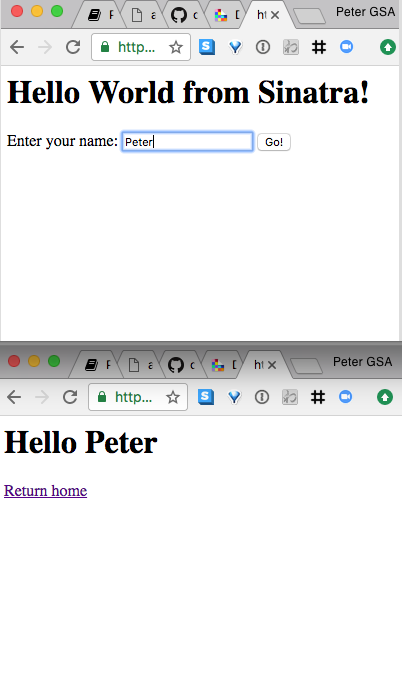
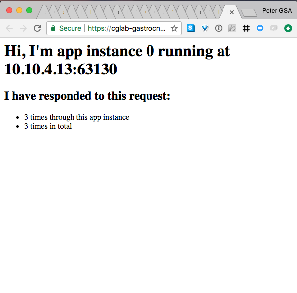

<!-- Start with workshop_00.md -->

# I want to have a _command line utility_ installed
# So that I can _deploy apps into cloud.gov_

---

# Why the `cf` CLI?

The Cloud Foundry command-line interface (CLI) is a multiplatform binary written in `Go` to interact with the _CF API_.  The CLI provides:

* Automation
* Collaboration
* Corroboration

^ You can put commands into files, with variable, and then run them. You can share code by viewing text files, or even copy/paste, in ways you can't with GUIs. And with version control you can corroborate that the change you mean to make is the change expressed by the code.

---

# Lab 2: Install cloudfoundry tools and login to cloud.gov

---
# 2.1 Select and install the appropriate installer for your computer: 

Go to [https://github.com/cloudfoundry/cli/releases](https://github.com/cloudfoundry/cli/releases) and select an `Installer` for your system. Download and go through the installation steps.

On Macs, with Homebrew, you can use: 

```sh
     brew cask install cloudfoundry-cli
```

On Workspaces, `cf` CLI is already installed.

---

# 2.1 continued...

After the installer has finished, run the command:

```sh
> cf
``` 

and you should see a list of command options.

---

# Check your work 2.1

You should see output similar the to the following:

```sh
PS /Users/peterburkholder> cf
cf version 6.26.0+9c9a261fd.2017-04-06, Cloud Foundry command line tool
Usage: cf [global options] command [arguments...] [command options]

Before getting started:
  config    login,l      target,t
  help,h    logout,lo

... [snip] ...
```

---

# 2.2 Login to cloud.gov with the _cf_ CLI

Try the built-in help:

```sh
cf login --help
```

Then, login:

```sh
cf login --sso -a https://api.fr.cloud.gov
```

---

# Check your work 2.2

You should see output similar to the following:

```
> cf login --help
NAME:
   login - Log user in

USAGE:
   cf login [-a API_URL] [-u USERNAME] [-p PASSWORD] [-o ORG] [--sso PASSCODE]
... [snip] ...
```

[.footer: continued ...]

---

# Check your work 2.2, continued

```
> cf login --sso -a https://api.fr.cloud.gov
API endpoint: https://api.fr.cloud.gov

One Time Code ( Get one at https://login.fr.cloud.gov/passcode )>
Authenticating...
OK

Targeted org sandbox-cao
Targeted space peter.burkholder
API endpoint:   https://api.fr.cloud.gov (API version: 2.95.0)
User:           peter.burkholder@cao.gov
Org:            sandbox-cao
Space:          peter.burkholder
```

---

# Further exploration

Try the following:

* `cf logoug`: Auto-suggest on _misspellings_
* `cf help`: Explore other commands
* `cf curl "/v2/spaces"`: Peek into the API internals[^1]

[^1]: This is peek at the guru-level view of Cloud Foundry. You'll not need this anytime soon.

---

# I want my website to be _accessible at a public URL_
# So that the _American people_ can read it

---


# 3 Static website

Our simplest example. We'll use `cf push` to send the files to cloud.gov, and it'll package the site and start to serive it.


---

# Lab 3: Download workshop labs and deploy a static website to YOURNAME.app.cloud.gov


---

# 3.1: Download labs

# FIXME -- all usg iwr or curl or wget of the zip file. 

**If you have `git` installed**, run: 

```
git clone https://github.com/18F/cg-workshop.git
cd cg-workshop
```

**Otherwise**, visit https://github.com/18F/cg-workshop, click the green `Clone or download` button, then 
`Download ZIP`. 

Unzip the downloaded <br>`cg-workshop-master.zip` and then `cd cg-workshop-master`


---

# Check your work 3.1

Run `ls`. You should see output similar to the following:

```powershell
> ls


    Directory: /Users/peterburkholder/Projects/18f/cg-workshop


Mode                LastWriteTime         Length Name
----                -------------         ------ ----
d-----          9/20/17   2:46 PM                00_task_setup
d-----          9/18/17   8:51 PM                01_task_static
d-----          9/18/17   9:26 PM                02_task_sinatra
d-----          9/20/17   4:19 PM                images
------          7/28/17  10:50 AM           1344 LICENSE.md
------          9/19/17   4:37 PM          13358 pitch.md
------          9/19/17   4:46 PM           3863 README.md
------          9/20/17  12:46 PM           4293 requirements.md
------          9/20/17  10:35 AM            810 tts.md
------          9/20/17   4:01 PM           1299 workshop_00.md
------          9/20/17   4:23 PM           5285 workshop.md
```

---


# Lab 3.2: Deploy static website

Don't literally use `myfname-lname` below. Use your own name like, `jane-doe`:

```
cd 03_static_site
cf push myfname-lname
```

---

# Check your work 3.2

The `cf push` should results should resemble:

```powershell
> cf push
> cf push peter.burkholder
Creating app peter.burkholder in org sandbox-cao ...
OK
... [snip]...
requested state: started
instances: 1/1
usage: 512M x 1 instances
urls: peterburkholder.app.cloud.gov
last uploaded: Thu Sep 21 01:02:16 UTC 2017
stack: cflinuxfs2
buildpack: staticfile

     state     since                    cpu    memory      disk      details
#0   running   2017-09-20 09:02:32 PM   0.0%   0 of 512M   0 of 1G
```

[.footer: continued...]

---

# Check your work 3.2, continued

Now try accessing your site:

```powershell
# powershell
iwr https://myfname-lname.app.cloud.gov
# or shell
curl https://myfname-lname.app.cloud.gov
# or mac
open https://myfname-lname.app.cloud.gov
```


E.g.: 

```powershell
> curl https://peterburkholder.app.cloud.gov
<body>
  <h1>Hello from cloud.gov</h1>
</body/
```
---


[.build-lists: true]
# What happens when I _cf push_? (v1.0)

* Upload: Files sent to CF
* Staging: Artifact is created (droplet)
* Running: Site starts on an web host

Site receives web requests 

---


---

# Further exploration

Try the following:

* `cf app myfname-lname`
  - info about your app
* `cf push myfname-name --random-route`
  - same app, diff url
* `CF_TRACE=true cf push myfname-lname`
  - get detailed logs

---

# I want to run a _dynamic webapp_
# So that users can _interact_ with us

---

# 4 Sinatra Application

We'll use _cf push_ again, but this time to _stage_ and run a dynamic web applicaton. We'll see how to use the _manifest.yml_ to set deployment options.

---

# What happens when I _cf push_? (v2.0)

* Upload: **App** files sent to CF
* Staging: **Executable** artifact is created (droplet)
Running: ~~Site~~ **App** starts on an ~~web~~ **app** host

~~Site~~ **App** receives web requests **(if it binds to TCP port)**

---

# Buildpacks create a runnable artifact called a droplet

App Files + Runtime Dependencies = App Artifact (droplet)

# Apps are started on specialized VMs called cells

If it’s a web process, it binds to a TCP port
Instances are distributed across multiple cells
Router distributes traffic across instances

---

# Where does the app run?

```
                           CONSUMER

                              |

                            ROUTER

                            /    \
                           /      \
                          /        \
                         /          \

                      CELL 1       CELL 2

                        |            |
      APP A INSTANCE 1 -|            |- APP A INSTANCE 2
      APP B INSTANCE 2 -|            |- APP B INSTANCE 1
```

---


# Lab 4: Deploy an application and set its _deployment manifest_

---

# 4.1:  Review the _deployment manifest_

Make sure you're in `cg-workshop/04_webapp`, then run

```powershell
more manifest.yml
```

---

# Check your work 4.1

The manifest should contain:

```yaml
---
applications:
- name: cglab
  random-route: true
  memory: 64m
#  buildpack: ruby_buildpack
```

Since all of us will push this same application, they can't all be at https://cglab.app.cloud.gov.

The lines starting with hashmarks, #, are comments and not (yet) used

---

# N.M Push the application

```powershell
cf push
```

---

# Check your work...

The cf push results should resemble those below. Note all the buildpacks (and use of buildpack detection)

```powershell, [.highlight: 9]
$ cf push
Using manifest file cg-workshop/04_webapp/manifest.yml
... [snip] ...
Starting app cglab in org sandbox-cao / space peter.burkholder as peter.burkholder@cao.gov...
Downloading nodejs_buildpack...
Downloading php_buildpack...
Downloading dotnet_core_buildpack...
Downloading java_buildpack...
Downloaded ruby_buildpack (81.6K)
... [snip] ...
```

[.footer: continued....]

---
# check your work, continued

The cf push final output should resemble below. Note the highlighted `urls`. Since we use `random-route` the URL is [https:/cglab-confessable-pardner.app.cloud.gov](https://cglab-confessable-pardner.app.cloud.gov)

```powershell, [.highlight: 4]
...
instances: 1/1
usage: 512M x 1 instances
urls: cglab-confessable-pardner.app.cloud.gov
last uploaded: Thu Sep 21 01:48:46 UTC 2017
stack: cflinuxfs2
buildpack: ruby

     state     since                    cpu    memory      disk      details
#0   running   2017-09-20 09:49:19 PM   0.0%   0 of 512M   0 of 1G
```

[.footer: continued....]

--- 

# check your work, continued

Interact with the webpage at <br>
https://cglab-RANDOM-WORDS.app.cloud.gov <br>
e.g., <br>
[https:/cglab-confessable-pardner.app.cloud.gov](https://cglab-confessable-pardner.app.cloud.gov)




---

# N.M Review the app status and health.

Run:

```
cf app cglab
```

How much memory and disk is it using?

---

# Check your work

The _cf app_ output should resemble:

```powershell, [.highlight: 6, 13]
Showing health and status for app cglab in org sandbox-cao 

name:              cglab
requested state:   started
instances:         1/1
usage:             512M x 1 instances
routes:            cglab-confessable-pardner.app.cloud.gov
last uploaded:     Wed 20 Sep 22:06:14 EDT 2017
stack:             cflinuxfs2
buildpack:         ruby

     state     since                  cpu    memory          disk          details
#0   running   2017-09-21T02:06:44Z   0.0%   19.2M of 512M   80.8M of 1G
```

---

# Further exploration

Try the following:

* Uncomment the `manifest.yml` lines with `buildpack` and `memory`, then run `cf push` and check status with `cf app cglab`. What's changed in staging or application status?
* How does the updated manifest change release time? Try `time cf push` (shell) or `Measure-Command {cf push}` (powershell)
* Run `cf buildpacks`. What languages are availble by default?

---

# I want to store data in a service
# So that it is persistent and shared

---


# 7. I can share persistent data between app instances

First we'll see the _services_ available to us, then use _create-service_ 
to provision a simple Redis data store. We'll then _bind_ that service to 
our application.  Our application we'll use its _environment variables_ to determine
the connection information


---

# 7.1 Review the available _services_

Run `cf marketplace` and look for the _redis_ services. Examine the details with `cf marketplace -s redis32`. 

---

# Check your work 7.1

```
$ cf marketplace
Getting services from marketplace in org sandbox-cao / space peter.burkholder as peter.burkholder@cao.gov...
OK

service                       plans                         description
aws-rds                       shared-psql, medium-psql* ... Persistent DBs using Amazon RDS
...
redis28                       standard         An open source in-memory data structure store.
redis32                       standard-ha, standard       An open source in-memory database.
```

---

# Check your work 7.1, continued

```
$ cf marketplace -s redis32
Getting service plan information for service redis32 as peter.burkholder@cao.gov...
OK

service plan   description                                             free or paid
standard-ha    Redis 3.2 with Redis Sentinel and persistent storage.   free
standard       Redis 3.2 with persistent storage.                      free
```

---

# 7.2 Create a Redis service with _create-service_

See the command help with `cf create-service -h`. Note the format is:
`cf create-service redis32  PLAN  NAME`

Then issue the command: 
`cf create-service redis32  standard  cglab-redis`

Wait one minute, then check your service with:
`cf service cglab-redis`

---

# Check your work 7.2

```
$ cf create-service redis32  standard  cglab-redis
Creating service instance cglab-redis in org sandbox-cao 
OK

Create in progress. Use 'cf services to check


$ cf service cglab-redis

Service instance: cglab-redis
Service: redis32
Bound apps:
... [snip] ...
Started: 2017-09-21T14:40:57Z
Updated: 2017-09-21T14:42:01Z
```

---

# 7.3 Associate service and app with _bind-service_

When `cf service cglab-redis` status is healthy, get
current app `environment` with: 
`cf env cglab`.

Then bind service with: 
`cf bind-service cglab cglab-redis`.

Compare new results of 
`cf env cglab`

---

# Check your work 7.3

```
$ cf env cglab
Getting env variables for app cglab in org sandbox-cao 
OK

System-Provided:


{
 "VCAP_APPLICATION": {
... 

$ cf bind-service cglab cglab-redis
Binding service cglab-redis to app cglab in org sandbox-cao 
OK
TIP: Use 'cf restage cglab' to ensure your changes take effect
```
---

# Check your work 7.3, continued
 
```
$ cf env cglab
Getting env variables for app cglab in org sandbox-cao
OK

System-Provided:
{
 "VCAP_SERVICES": {
  "redis32": [
...
```

---

# 7.4 Push the new version of our app

Change directory to 
`cg-workshop/07-shared-state`

and run 
`cf push`

Check status with 
`cf app cglab` 

and visit your app at the random-route URL. Refresh page multiple times.

---

# Check your work 7.3

```
$ cf push
Using manifest file .../cg-workshop/07-shared-state/manifest.yml

Updating app cglab in org sandbox-cao 
OK
...
$ cf app cglab
Showing health and status for app cglab in org sandbox-cao 

name:              cglab
requested state:   started ...
routes:            cglab-gastrocnemian-calefaction.app.cloud.gov
...

     state     since                  cpu    memory         disk         
#0   running   2017-09-21T15:17:06Z   0.0%   19.8M of 64M   83.9M of 256M
```
---

# Check your work 7.3, continued




---

# 7.4 Scaling

Create an additional app instance with 
`cf scale cglab -i 2`

Refresh webapp page multiple times

Then scale back to one with 
`cf scale cglab -i 1`

---

# Check your work 7.4 (TK)

--- 

# Review: Where does the app run?

```
                           CONSUMER

                              |

                            ROUTER

                            /    \
                           /      \
                          /        \
                         /          \

                      CELL 1       CELL 2

                        |            |
      APP A INSTANCE 1 -|            |- APP A INSTANCE 2
      APP B INSTANCE 2 -|            |- APP B INSTANCE 1
```

---

# Further exploration

* Go to your app's URL + '/env": http://cglab....app.cloud.gov/env
* Use `cf set-env` to add new variables
  * Hint: You'll need `cf restage` for your app to pick them up.

---

# I want to know what my CF app is doing
# So that I can debug it

---

#  6. I can investigate my apps to determine the cause of errors

---


* Maintainance, logging and debugging
  * Restage to pick up new buildpacks: 
  `cf restage cglab`
  * Platform availability: 
  `cf events cglab`
  * Logs:
  `cf logs cglab`
  `cf logs --recent cglab`
  * Live instance degbugging: 
  `cf ssh cglab`
  * [https://cloudgov.statuspage.io](https://cloudgov.statuspage.io)
  * [https://logs.fr.cloud.gov](https://logs.fr.cloud.gov)

---

1. CircleCI  - Demo only! or optional for GitHub users 
  * Accomplished:
    - Ensuring continuous integration testing
    - Ensure consistent environments

---

1. Access control -Demo only, skip if short on time.
  * `cf orgs`
  * `cf spaces`
  * Discussion / Demo only
  * Accomplished: 
    * Inbound access control w/ oauth - 
    * Egress to external providers by fixed IP

---

# YAGNI

1. Blue-green releases
  * Autopilot
1. Optional: Worker apps
  * See Aidan's notes for a good write-up
1. Development tips
  * `cf local`

---

# Closing: The 12-factor App

---

# Parking lot

- health checks